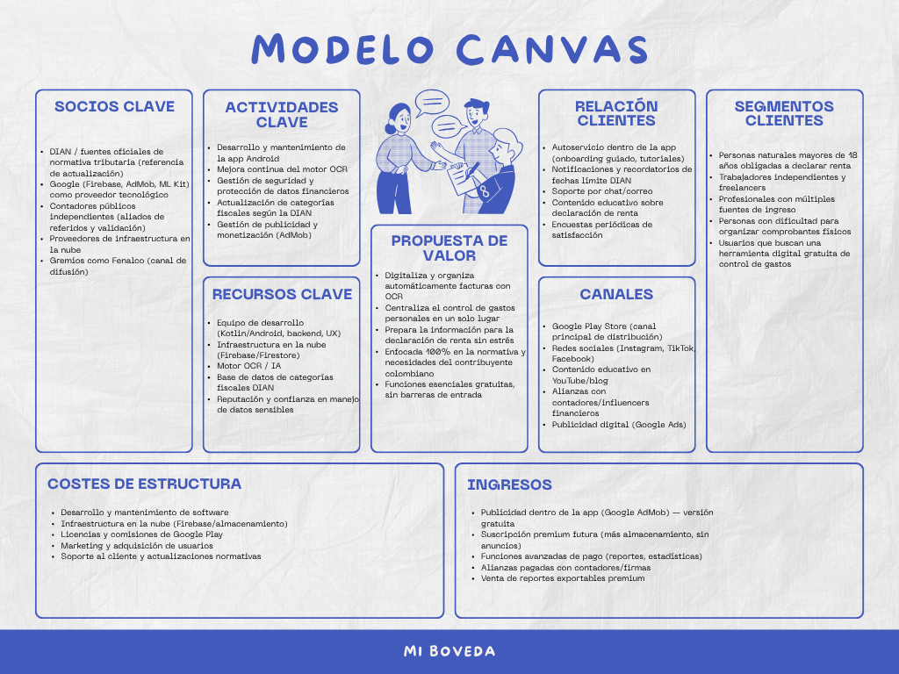
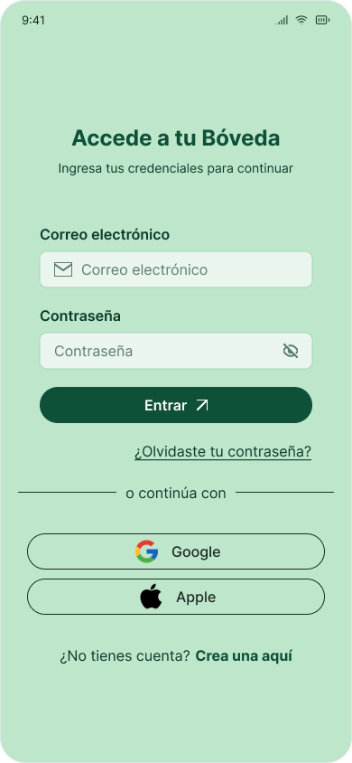
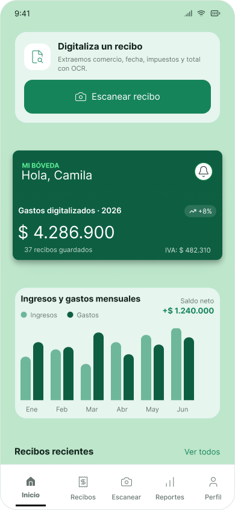

# Modelo Canvas y Mockups
## 1. Modelo Canvas

    

<strong>Figura 1.</strong> Modelo Canva del Proyecto.

### 1.1. Propuesta de Valor
Es una aplicación móvil que digitaliza automáticamente las facturas mediante OCR, centraliza el control de gastos personales en un solo lugar, y prepara al usuario para su declaración de renta sin estrés, sin hojas de cálculo y sin carpetas físicas. Todo esto, con las funciones esenciales 100% gratuitas y sin barreras de entrada.

### 1.2. Segmento de Clientes
Personas naturales mayores de 18 años obligadas a declarar renta en Colombia: trabajadores independientes, freelancers, profesionales con más de una fuente de ingreso, y en general, cualquier persona que hoy pierde comprobantes físicos y busca una herramienta digital simple para controlar sus gastos.

No es un producto genérico de finanzas personales importado de otro país. Está diseñado desde cero pensando en el contribuyente colombiano.

### 1.3. Canales
La distribución es directa sera por medio de Google Play Store como canal principal, apoyado en redes sociales como Instagram, TikTok y Facebook, contenido educativo en YouTube y en un blog, y alianzas estratégicas con contadores e influenciadores financieros que ya tienen la confianza de nuestro público.

### 1.4. Relación con Clientes
Una vez dentro, la relación con el usuario se construye con un autoservicio guiado: onboarding simple, recordatorios automáticos de fechas límite de la DIAN, soporte directo por chat, y contenido educativo constante. No dejamos al usuario solo frente a su información financiera.

### 1.5. Socios Clave
Nuestros socios clave incluyen a Google, como proveedor tecnológico a través de Firebase, AdMob y Machine Learning Kit; contadores públicos independientes que validan y refieren nuestra herramienta; proveedores de infraestructura en la nube; y gremios como Fenalco como canal de difusión.

### 1.6. Actividades Clave
Nuestras actividades clave se centran en tres frentes: el desarrollo y mantenimiento continuo de la aplicación, la mejora constante del motor OCR para maximizar la precisión de lectura, y la actualización permanente de categorías fiscales conforme cambia la normativa de la DIAN — todo esto sin descuidar la seguridad de los datos financieros de nuestros usuarios.

### 1.7. Recursos Clave
Un equipo de desarrollo en Kotlin y Android, infraestructura en la nube con Firebase y Firestore, un motor de inteligencia artificial para el reconocimiento óptico de caracteres, y algo que no se compra de un día para otro: la confianza del usuario en el manejo de su información financiera sensible.

### 1.8. Estructura de Costos
Nuestra estructura de costos es controlada y escalable: desarrollo y mantenimiento de software, infraestructura en la nube, comisiones de Google Play, marketing de adquisición de usuarios y soporte al cliente.

### 1.9. Fuentes de Ingreso
El modelo es freemium: la versión gratuita se sostiene con publicidad a través de Google AdMob. A partir de ahí, escalamos con una suscripción premium con mayor almacenamiento y sin publicidad, funciones avanzadas de reportes y estadísticas, y alianzas comerciales pagadas con contadores y firmas que quieran integrarse a nuestra base de usuarios.

## 2. Mockups

  <!-- Contenedor Imagen 1 -->
  

    <table align="center">
<tr>
    <!-- Primera Imagen -->
    <td width="45%" align="center" valign="top">
    
     
    <strong>Figura 2.</strong> Esta es la pantalla del <em><strong>Login</strong></em>.
    </td>
    
<td width="10%">
</td>
    
<!-- Segunda Imagen -->
<td width="45%" align="center" valign="top">

 
<strong>Figura 3.</strong> Esta es la pantalla de <em><strong>Inicio</strong></em>.
</td>
</tr>
</table>
  

  
  <!-- Espaciador invisible -->
  

  <!-- Contenedor Imagen 2 -->
<table align="center">
<tr>
    <!-- Primera Imagen -->
    <td width="45%" align="center" valign="top">
    
     
    <strong>Figura 4.</strong> Esta es la pantalla del <em><strong>Escaneo OCR</strong></em>.
    </td>
    
<td width="10%">
</td>
    
<!-- Segunda Imagen -->
<td width="45%" align="center" valign="top">

 
<strong>Figura 3.</strong> Esta es la pantalla de la <em><strong>Factura digitalizada</strong></em>.
</td>
</tr>
</table>

